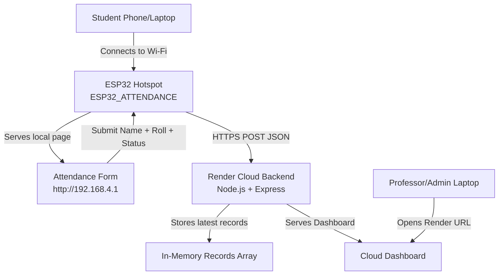
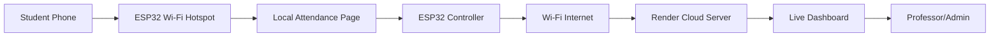
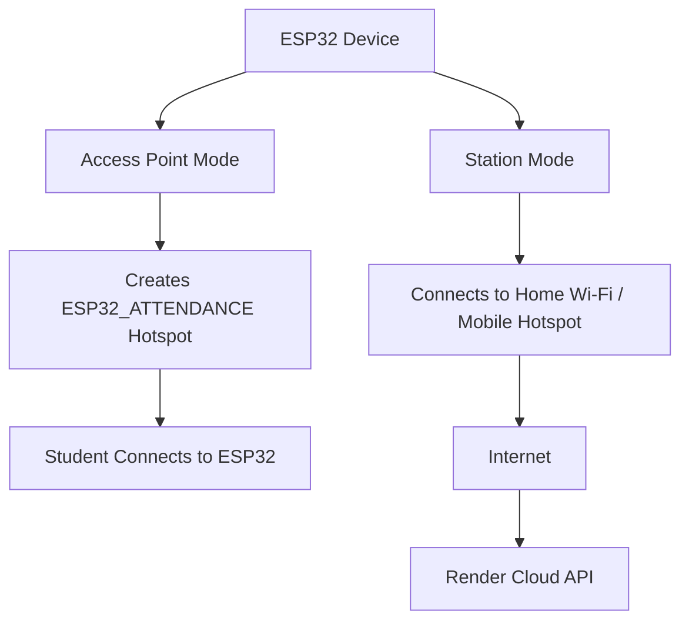
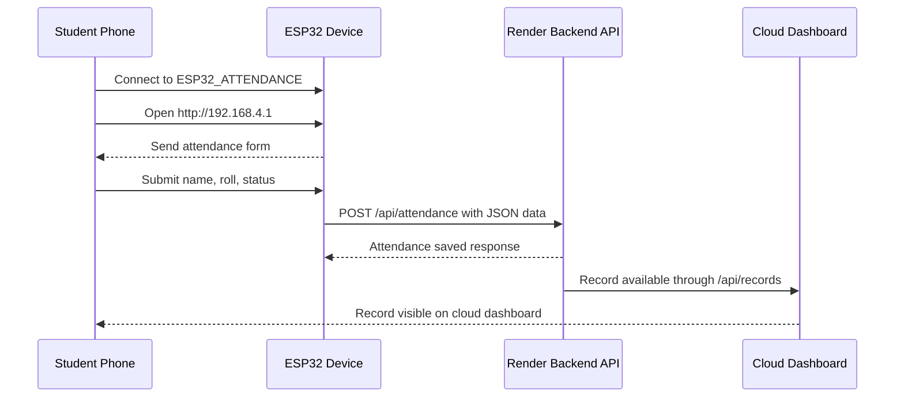
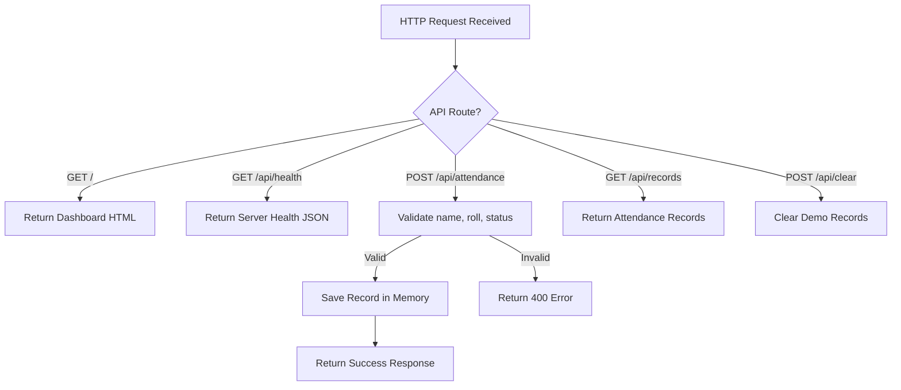
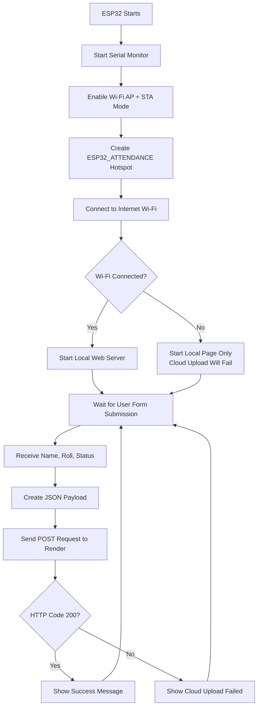
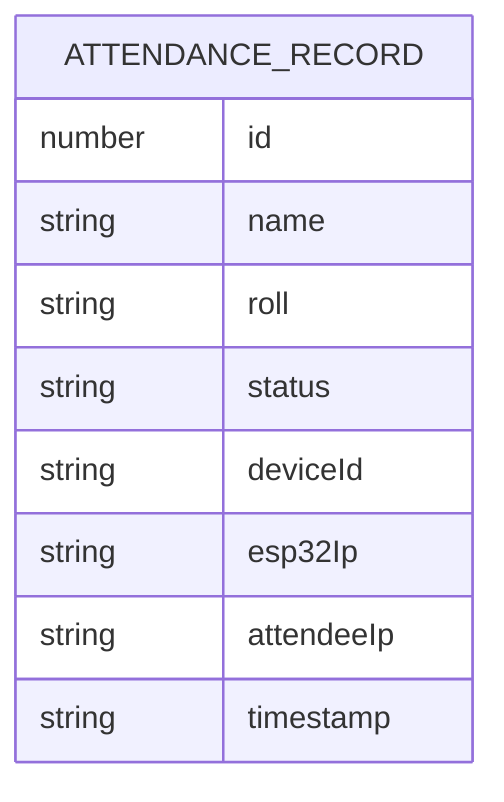
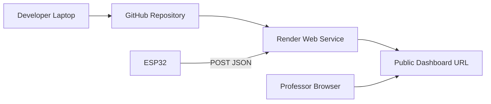

# ESP32 Smart Attendance & Proximity Detection System

A cloud-connected IoT attendance prototype using **ESP32**, **Wi-Fi hotspot proximity**, **Node.js/Express**, and a live **Render cloud dashboard**.

The system allows a nearby user/student to connect to an ESP32-created Wi-Fi hotspot, open a local attendance page, submit attendance, and view the result live on a cloud dashboard.

---

## Table of Contents

- [Project Overview](#project-overview)
- [Key Features](#key-features)
- [Live System Flow](#live-system-flow)
- [Technology Stack](#technology-stack)
- [Hardware Requirements](#hardware-requirements)
- [Software Requirements](#software-requirements)
- [System Architecture](#system-architecture)
- [Detailed Working Explanation](#detailed-working-explanation)
- [Diagrams](#diagrams)
- [Project Folder Structure](#project-folder-structure)
- [Backend API Endpoints](#backend-api-endpoints)
- [ESP32 Firmware Overview](#esp32-firmware-overview)
- [Setup Guide](#setup-guide)
- [Demo Guide](#demo-guide)
- [Troubleshooting](#troubleshooting)
- [Limitations](#limitations)
- [Future Improvements](#future-improvements)
- [Commercial Upgrade Roadmap](#commercial-upgrade-roadmap)
- [Security Notes](#security-notes)
- [License](#license)

---

## Project Overview

This project is an **ESP32-based smart attendance and proximity detection system**.

The ESP32 works as a local attendance device. It creates a Wi-Fi hotspot named:

```text
ESP32_ATTENDANCE
```

A nearby student/user connects to this hotspot and opens:

```text
http://192.168.4.1
```

The user enters their:

- Name
- Roll number
- Attendance status: `CHECK_IN` or `CHECK_OUT`

The ESP32 receives the form data and sends it to a cloud backend hosted on **Render**. The backend stores the latest attendance records in memory and displays them on a live web dashboard.

---

## Key Features

- ESP32 creates its own local Wi-Fi hotspot
- Local attendance webpage hosted directly on ESP32
- Nearby/proximity-based attendance submission
- Cloud backend using Node.js and Express.js
- Live dashboard hosted on Render
- REST API for attendance submission
- Real-time dashboard auto-refresh
- Check-in and check-out support
- ESP32 device ID tracking
- Attendee IP tracking
- Simple zero-cost prototype using free tools
- Beginner-friendly IoT + cloud project

---

## Live System Flow

```text
Student Phone/Laptop
        ↓
Connects to ESP32 Wi-Fi hotspot
        ↓
Opens local page: http://192.168.4.1
        ↓
Submits name, roll number, and status
        ↓
ESP32 receives the form data
        ↓
ESP32 sends JSON data to Render API
        ↓
Node.js backend stores the record
        ↓
Cloud dashboard displays live attendance
```

---

## Technology Stack

| Layer | Technology Used |
|---|---|
| Hardware | ESP32 Dev Module |
| Firmware | Arduino C++ |
| Local Web Server | ESP32 `WebServer.h` |
| Wi-Fi Communication | ESP32 Wi-Fi AP + STA mode |
| Cloud Backend | Node.js + Express.js |
| Frontend Dashboard | HTML, CSS, JavaScript |
| Hosting | Render |
| Code Hosting | GitHub |
| API Format | JSON over HTTP/HTTPS |

---

## Hardware Requirements

Minimum hardware required:

| Component | Purpose |
|---|---|
| ESP32 Dev Module | Main IoT device |
| USB Data Cable | Upload code and power ESP32 |
| Laptop/PC | Development and dashboard viewing |
| Phone | Attendance submission device |
| Wi-Fi/Hotspot | Internet connection for ESP32 |

Optional future hardware:

| Component | Possible Use |
|---|---|
| RFID Reader | Card-based attendance |
| OLED Display | Show device status |
| Buzzer | Confirmation sound |
| LED | Visual status indicator |
| Enclosure | Commercial device casing |

---

## Software Requirements

Install the following:

| Software | Purpose |
|---|---|
| Arduino IDE | ESP32 firmware upload |
| ESP32 Board Package | ESP32 support in Arduino IDE |
| Node.js | Backend runtime |
| npm | Package manager |
| GitHub Account | Code repository |
| Render Account | Cloud hosting |
| Web Browser | Dashboard and testing |

---

## System Architecture



---

## Detailed Working Explanation

The ESP32 performs two Wi-Fi jobs at the same time:

### 1. Station Mode

The ESP32 connects to an external Wi-Fi network or mobile hotspot to access the internet.

```text
ESP32 → Home Wi-Fi / Mobile Hotspot → Internet → Render Cloud
```

This is required because the ESP32 needs internet access to upload attendance data.

### 2. Access Point Mode

The ESP32 also creates its own Wi-Fi hotspot:

```text
ESP32_ATTENDANCE
```

A nearby student connects to this hotspot and opens:

```text
http://192.168.4.1
```

This is why the system is considered proximity-based. A user must be physically near the ESP32 hotspot to access the attendance page.

---

## Diagrams

### 1. Overall Architecture Diagram



---

### 2. ESP32 Dual Wi-Fi Mode Diagram



---

### 3. Attendance Submission Sequence Diagram



---

### 4. Backend API Flow



---

### 5. ESP32 Firmware Flow



---

### 6. Data Model Diagram

Current prototype uses in-memory storage.



---

### 7. Deployment Architecture



---

## Project Folder Structure

```text
esp32-attendance-system/
│
├── package.json
├── package-lock.json
└── server.js
```

### File Explanation

| File | Purpose |
|---|---|
| `package.json` | Defines Node.js project, scripts, and dependencies |
| `package-lock.json` | Stores exact package versions |
| `server.js` | Main Express backend and dashboard code |

---

## Backend API Endpoints

### 1. Health Check

```http
GET /api/health
```

Purpose:

Checks whether the backend server is running.

Example response:

```json
{
  "status": "ok",
  "message": "ESP32 Attendance Backend Running",
  "totalRecords": 0,
  "serverTime": "2026-07-06T18:05:35.780Z"
}
```

---

### 2. Submit Attendance

```http
POST /api/attendance
```

Purpose:

Receives attendance data from ESP32.

Example request body:

```json
{
  "name": "Suprajit",
  "roll": "CSE001",
  "status": "CHECK_IN",
  "deviceId": "ESP32_DEVICE_ID",
  "esp32Ip": "192.168.1.9",
  "attendeeIp": "192.168.4.2"
}
```

Example response:

```json
{
  "success": true,
  "message": "Attendance saved successfully"
}
```

---

### 3. Get Records

```http
GET /api/records
```

Purpose:

Returns all attendance records to the dashboard.

---

### 4. Clear Records

```http
POST /api/clear
```

Purpose:

Clears all demo attendance records.

---

## ESP32 Firmware Overview

The ESP32 firmware performs these tasks:

1. Connects to external Wi-Fi for internet
2. Creates a local hotspot named `ESP32_ATTENDANCE`
3. Hosts a local attendance page at `http://192.168.4.1`
4. Receives submitted form data
5. Creates a JSON payload
6. Sends data to Render backend using HTTPS POST
7. Displays success or failure message on the local webpage
8. Prints debugging information in Serial Monitor

Important code configuration:

```cpp
const char* HOME_WIFI_SSID = "YOUR_WIFI_NAME";
const char* HOME_WIFI_PASS = "YOUR_WIFI_PASSWORD";

const char* AP_SSID = "ESP32_ATTENDANCE";
const char* AP_PASS = "12345678";

const char* RENDER_API = "https://esp32-attendance-system.onrender.com/api/attendance";
```

Do not commit real Wi-Fi passwords to GitHub.

---

## Setup Guide

### Step 1: Clone or Download the Repository

```bash
git clone https://github.com/YOUR_USERNAME/esp32-attendance-system.git
cd esp32-attendance-system
```

Or download the repository ZIP from GitHub.

---

### Step 2: Install Backend Dependencies

```bash
npm install
```

---

### Step 3: Run Backend Locally

```bash
npm start
```

Expected output:

```text
Server running on port 3000
```

Open:

```text
http://localhost:3000
```

---

### Step 4: Test Backend Locally

Using PowerShell:

```powershell
$body = @{
  name = "Test Student"
  roll = "CSE001"
  status = "CHECK_IN"
  deviceId = "ESP32-DEMO"
  esp32Ip = "192.168.1.10"
  attendeeIp = "192.168.4.2"
} | ConvertTo-Json
```

```powershell
Invoke-RestMethod -Uri "http://localhost:3000/api/attendance" -Method Post -ContentType "application/json" -Body $body
```

---

### Step 5: Deploy Backend to Render

Render settings:

| Field | Value |
|---|---|
| Runtime | Node |
| Build Command | `npm install` |
| Start Command | `npm start` |
| Root Directory | Leave blank |
| Plan | Free |

After deployment, open:

```text
https://your-render-service.onrender.com
```

Health check:

```text
https://your-render-service.onrender.com/api/health
```

---

### Step 6: Configure ESP32

In Arduino IDE:

1. Install ESP32 board package
2. Select board: `ESP32 Dev Module`
3. Select correct COM port
4. Paste ESP32 firmware code
5. Update Wi-Fi name and password
6. Upload code
7. Open Serial Monitor at `115200 baud`

Expected Serial Monitor output:

```text
Starting ESP32 Smart Attendance System...
ESP32 Hotspot Name: ESP32_ATTENDANCE
ESP32 Hotspot Password: 12345678
ESP32 Hotspot IP: 192.168.4.1
Connecting to internet Wi-Fi....
Connected to internet Wi-Fi
ESP32 Internet IP: 192.168.x.x
Local attendance web server started
Open this page:
http://192.168.4.1
```

---

## Demo Guide

### Before Demo

1. Turn on the Wi-Fi or hotspot used by ESP32
2. Plug in ESP32
3. Open Render dashboard
4. Wait if Render takes time to wake up
5. Open Arduino Serial Monitor if debugging is needed

### During Demo

1. Show the cloud dashboard
2. Show ESP32 device powered on
3. Connect phone to `ESP32_ATTENDANCE`
4. Open `http://192.168.4.1`
5. Enter name and roll number
6. Click `Check In`
7. Refresh or wait on the dashboard
8. Show the live attendance record

### Demo Script

```text
This is an ESP32-based smart attendance and proximity detection system.
The ESP32 creates a local Wi-Fi hotspot.
Only nearby users can connect to this hotspot and open the local attendance page.
After entering name and roll number, the ESP32 sends the attendance data to a cloud backend hosted on Render.
The dashboard updates in real time and shows the attendance record.
This project demonstrates embedded systems, IoT, local web server, cloud API communication, and real-time monitoring.
```

---

## Troubleshooting

| Problem | Cause | Solution |
|---|---|---|
| ESP32 upload fails | Wrong boot mode | Hold BOOT while uploading |
| COM port not visible | Cable issue | Use USB data cable |
| Wi-Fi connection fails | Wrong SSID/password or 5 GHz Wi-Fi | Use correct 2.4 GHz Wi-Fi |
| Local page opens but cloud upload fails | ESP32 has no internet | Check hotspot/router connection |
| Phone says no internet | ESP32 hotspot has no internet for phone | Ignore and open `http://192.168.4.1` |
| Render loads slowly | Free instance sleeping | Wait 30–60 seconds |
| HTTP Code 404 | Wrong API URL | Use `/api/attendance` |
| HTTP Code -1 | Network/HTTPS issue | Wake Render and check Wi-Fi |
| Data disappears | In-memory storage | Add a database in future version |

---

## Limitations

Current prototype limitations:

1. Attendance data is stored in memory only
2. Records may reset when Render restarts
3. No authentication system
4. No student database
5. No duplicate attendance prevention
6. No admin login
7. No permanent report storage
8. Manual name and roll entry
9. ESP32 depends on external Wi-Fi for cloud upload
10. Render free service may sleep after inactivity

---

## Future Improvements

Planned improvements:

- Add MongoDB, Firebase, PostgreSQL, or Supabase database
- Add student registration
- Add admin login
- Add teacher dashboard
- Add student dashboard
- Add duplicate attendance prevention
- Add subject-wise attendance
- Add class/session management
- Export attendance as CSV/PDF
- Add QR code-based verification
- Add RFID-based verification
- Add OLED display to ESP32
- Add buzzer or LED confirmation
- Add multiple ESP32 classroom devices
- Add device online/offline monitoring
- Add mobile app support

---

## Commercial Upgrade Roadmap

### Version 1: Working Prototype

Current system:

```text
ESP32 hotspot → Local attendance form → Render dashboard
```

Status: Completed

---

### Version 2: Database Version

Add:

- Permanent database
- Attendance history
- Date-wise filtering
- Duplicate prevention

---

### Version 3: Admin Dashboard

Add:

- Admin login
- Class-wise records
- Student-wise records
- Export reports
- Attendance percentage

---

### Version 4: Multi-Device Campus System

Add:

- Multiple ESP32 devices
- Classroom mapping
- Device health monitoring
- Online/offline status

---

### Version 5: Verification Layer

Add one or more:

- QR code verification
- RFID card verification
- OTP verification
- Face recognition support

---

## Security Notes

Important security recommendations:

- Do not upload real Wi-Fi credentials to GitHub
- Use environment variables for backend secrets in production
- Add user authentication before commercial deployment
- Use a proper database with access control
- Use HTTPS for cloud communication
- Validate roll numbers from a registered student database
- Prevent duplicate attendance
- Add logs for audit and monitoring

---

## One-Line Summary

This project uses ESP32 as a smart local attendance device that collects attendance through its own Wi-Fi webpage and sends the data to a live cloud dashboard hosted on Render.

---

## License

This project is created for educational and prototype purposes.  
You may extend it into a larger academic or commercial IoT attendance platform.
